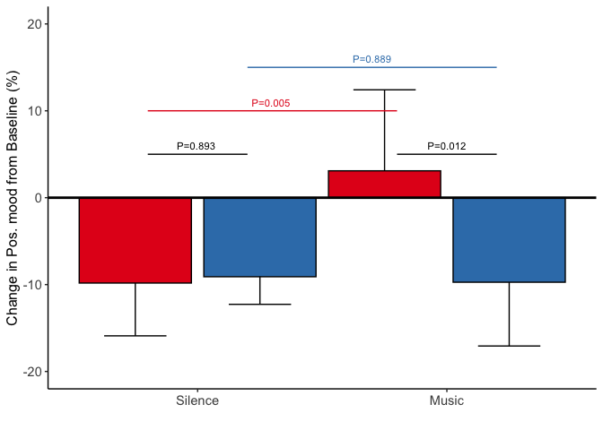
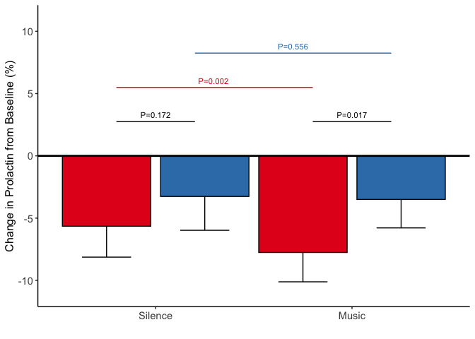
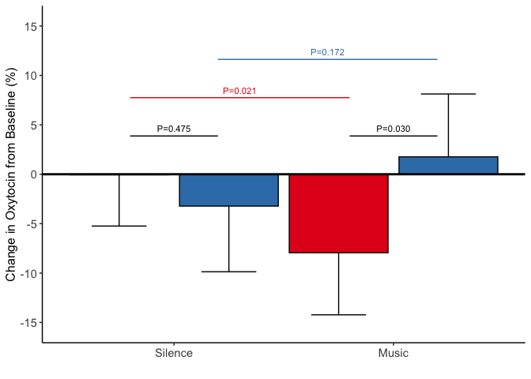
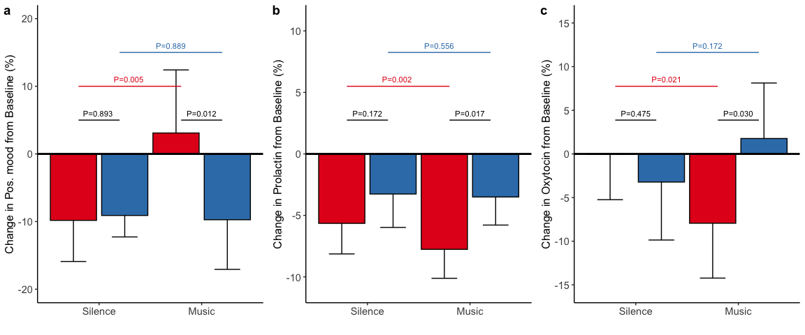

<!-- README.md is generated from README.Rmd. Please edit that file -->

# Sad music and hormones

## Data and scripts

The following are all statistical analyses reported in the paper. All
data files are available at Github repository:
<https://github.com/tuomaseerola/sad-music-hormones>

*Created: 9/4/2021*.

## Data files

-   `background.csv`: Individual differences variable (`QoL`, `TAS`,
    `MSI`, etc.) with unique `ID` for each participant.

-   `emotions.csv`: Self-reported emotions (`moved`, `relaxed`, `sad`,
    `anxious`, `pleasantness`).

-   `mood_and_emotions.csv`: Mood and emotions (`pos` and `neg` moods).

-   `aggregate_data.csv`: Hormone variables (`PRL`, `OXY`, `CRT`,
    `ACTH`, `CRP`) and participants IDs and Conditions.

-   `EDA.csv`: Electrodermal variables
    (`CDA.ISCR`,`CDA.nSCR`,`CDA.AmpSum`,`CDA.Tonic`) and participants
    IDs and Conditions.

-   `HRV.csv`: Heart rate variability predictors
    (`SDNN`,`LF`,`HF`,`LF/HF`) and participants IDs and Conditions.

## R Scripts

-   `analysis_moods.R`: Reads and preprocesses data (relative change,
    outliers), and runs GLMM and produces planned contrasts.
-   `analysis_emotions.R`: Reads and preprocesses data (relative change,
    outliers), and runs GLMM and produces planned contrasts.
-   `analysis_EDA.R`: Reads and preprocesses data (relative change,
    outliers), and runs GLMM and produces planned contrasts.
-   `analysis_HRV.R`: Reads and preprocesses data (relative change,
    outliers), and runs GLMM and produces planned contrasts.
-   `figure1.R`: Combines the plots created by the other scripts and
    produces a figure.

# Analysis of moods

``` r
source('analysis_moods.R')
```

| contrast   |   estimate |        SE |  df |    t.ratio |   p.value |
|:-----------|-----------:|----------:|----:|-----------:|----------:|
| HIGH - LOW | -0.0420139 | 0.0508369 |  60 | -0.8264444 | 0.4118265 |

| contrast   | effect.size |        SE |  df |   lower.CL |  upper.CL |
|:-----------|------------:|----------:|----:|-----------:|----------:|
| HIGH - LOW |  -0.2100264 | 0.2548547 |  60 | -0.7198117 | 0.2997589 |

| contrast   |  estimate |        SE |  df |  t.ratio |   p.value |
|:-----------|----------:|----------:|----:|---------:|----------:|
| HIGH - LOW | 0.0577381 | 0.1253117 |  60 | 0.460756 | 0.6466395 |

## Negative moods

| Empathy | Condition |   n |      m |     sd |    se |     LCI |    UCI |
|:--------|:----------|----:|-------:|-------:|------:|--------:|-------:|
| HIGH    | Silence   |  32 | -7.112 | 12.352 | 2.184 | -11.392 | -2.832 |
| HIGH    | Music     |  32 |  4.874 | 32.739 | 5.788 |  -6.470 | 16.217 |
| LOW     | Silence   |  30 | -1.534 | 12.922 | 2.359 |  -6.158 |  3.090 |
| LOW     | Music     |  30 |  2.246 | 25.675 | 4.688 |  -6.942 | 11.433 |

Neg. moods across conditions and groups.

| contrast                                        | estimate |    SE |      df | t.ratio | p.value |
|:------------------------------------------------|---------:|------:|--------:|--------:|--------:|
| Silence - High Empathy vs Silence - Low Empathy |   -5.577 | 5.773 | 115.299 |  -0.966 |   0.336 |

Pos. mood in Silence.

| contrast                                    | estimate |    SE |      df | t.ratio | p.value |
|:--------------------------------------------|---------:|------:|--------:|--------:|--------:|
| Music - High Empathy vs Music - Low Empathy |    2.628 | 5.773 | 115.299 |   0.455 |    0.65 |

Pos. mood in Music

| contrast                                       | estimate |    SE |  df | t.ratio | p.value |
|:-----------------------------------------------|---------:|------:|----:|--------:|--------:|
| Silence - High Empathy vs Music - High Empathy |  -11.985 | 5.073 |  60 |  -2.363 |   0.021 |

Pos. mood in High Empathy

| contrast                                     | estimate |    SE |  df | t.ratio | p.value |
|:---------------------------------------------|---------:|------:|----:|--------:|--------:|
| Silence - Low Empathy vs Music - Low Empathy |    -3.78 | 5.239 |  60 |  -0.721 |   0.473 |

Pos. mood in Low Empathy

## Positive moods

| Empathy | Condition |   n |      m |     sd |    se |     LCI |    UCI |
|:--------|:----------|----:|-------:|-------:|------:|--------:|-------:|
| HIGH    | Silence   |  32 | -9.823 | 17.539 | 3.100 | -15.900 | -3.746 |
| HIGH    | Music     |  32 |  3.095 | 26.908 | 4.757 |  -6.228 | 12.418 |
| LOW     | Silence   |  30 | -9.098 |  8.871 | 1.620 | -12.272 | -5.923 |
| LOW     | Music     |  30 | -9.728 | 20.512 | 3.745 | -17.068 | -2.388 |

Pos. moods across conditions and groups.

| contrast                                        | estimate |    SE |      df | t.ratio | p.value |
|:------------------------------------------------|---------:|------:|--------:|--------:|--------:|
| Silence - High Empathy vs Silence - Low Empathy |   -0.681 | 5.042 | 114.032 |  -0.135 |   0.893 |

Pos. mood in Silence.

| contrast                                    | estimate |    SE |      df | t.ratio | p.value |
|:--------------------------------------------|---------:|------:|--------:|--------:|--------:|
| Music - High Empathy vs Music - Low Empathy |   12.823 | 5.004 | 113.739 |   2.563 |   0.012 |

Pos. mood in Music

| contrast                                       | estimate |    SE |     df | t.ratio | p.value |
|:-----------------------------------------------|---------:|------:|-------:|--------:|--------:|
| Silence - High Empathy vs Music - High Empathy |  -12.873 | 4.403 | 60.055 |  -2.924 |   0.005 |

Pos. mood in High Empathy

| contrast                                     | estimate |    SE |     df | t.ratio | p.value |
|:---------------------------------------------|---------:|------:|-------:|--------:|--------:|
| Silence - Low Empathy vs Music - Low Empathy |    0.631 | 4.502 | 59.153 |    0.14 |   0.889 |

Pos. mood in Low Empathy



# Analysis of emotions

``` r
source('analysis_emotions.R')
```

|                                          | Estimate | Std. Error |      df | t value | Pr(&gt;\|t\|) |
|:-----------------------------------------|---------:|-----------:|--------:|--------:|--------------:|
| (Intercept)                              |   33.149 |     11.113 | 304.586 |   2.983 |         0.003 |
| as.numeric(variable)                     |   12.741 |      3.265 | 246.000 |   3.902 |         0.000 |
| as.numeric(Empathy)                      |   -6.115 |      7.097 | 304.586 |  -0.862 |         0.390 |
| as.numeric(variable):as.numeric(Empathy) |   -1.410 |      2.085 | 246.000 |  -0.676 |         0.500 |

MANOVA across emotions (variable) and Emapthy.

| contrast   | variable     | estimate |    SE |      df | t.ratio | p.value |
|:-----------|:-------------|---------:|------:|--------:|--------:|--------:|
| HIGH - LOW | sad          |    8.254 | 5.861 | 272.453 |   1.408 |   0.160 |
| HIGH - LOW | anxious      |    2.596 | 5.861 | 272.453 |   0.443 |   0.658 |
| HIGH - LOW | relaxed      |   16.836 | 5.861 | 272.453 |   2.872 |   0.004 |
| HIGH - LOW | moved        |   14.874 | 5.861 | 272.453 |   2.538 |   0.012 |
| HIGH - LOW | pleasantness |    9.166 | 5.861 | 272.453 |   1.564 |   0.119 |

Comparison of Empathy groups across emotions scales.

| variable     | Empathy |   n |      m |     sd |    se |    LCI |    UCI |
|:-------------|:--------|----:|-------:|-------:|------:|-------:|-------:|
| sad          | HIGH    |  32 | 49.664 | 26.157 | 4.624 | 40.601 | 58.726 |
| sad          | LOW     |  30 | 41.409 | 26.745 | 4.883 | 31.839 | 50.980 |
| anxious      | HIGH    |  32 | 24.098 | 26.779 | 4.734 | 14.820 | 33.376 |
| anxious      | LOW     |  30 | 21.502 | 26.012 | 4.749 | 12.194 | 30.810 |
| relaxed      | HIGH    |  32 | 79.395 | 17.557 | 3.104 | 73.312 | 85.478 |
| relaxed      | LOW     |  30 | 62.559 | 25.943 | 4.737 | 53.276 | 71.842 |
| moved        | HIGH    |  32 | 67.217 | 20.940 | 3.702 | 59.962 | 74.472 |
| moved        | LOW     |  30 | 52.343 | 25.191 | 4.599 | 43.329 | 61.357 |
| pleasantness | HIGH    |  32 | 84.758 | 14.606 | 2.582 | 79.697 | 89.818 |
| pleasantness | LOW     |  30 | 75.592 | 16.703 | 3.050 | 69.615 | 81.569 |

Self-report means across empathy groups.

# Analysis of hormones

``` r
source('analysis_hormones.R')
```

| contrast   | estimate |   SE |  df | t.ratio | p.value |
|:-----------|---------:|-----:|----:|--------:|--------:|
| HIGH - LOW |   -0.091 | 0.14 |  60 |  -0.649 |   0.519 |

PRL Baseline

| contrast   | estimate |    SE |  df | t.ratio | p.value |
|:-----------|---------:|------:|----:|--------:|--------:|
| HIGH - LOW |    0.131 | 0.115 |  60 |   1.134 |   0.261 |

OXY Baseline

| contrast   | estimate |    SE |  df | t.ratio | p.value |
|:-----------|---------:|------:|----:|--------:|--------:|
| HIGH - LOW |   -0.172 | 0.117 |  60 |  -1.471 |   0.147 |

CRT Baseline

| contrast   | estimate |    SE |  df | t.ratio | p.value |
|:-----------|---------:|------:|----:|--------:|--------:|
| HIGH - LOW |   -0.005 | 0.109 |  60 |  -0.048 |   0.961 |

ACTH Baseline

| contrast   | estimate |    SE |  df | t.ratio | p.value |
|:-----------|---------:|------:|----:|--------:|--------:|
| HIGH - LOW |    0.078 | 0.163 |  60 |   0.479 |   0.634 |

CRP Baseline

## PRL

| contrast                                        | estimate |    SE |     df | t.ratio | p.value |
|:------------------------------------------------|---------:|------:|-------:|--------:|--------:|
| Silence - High Empathy vs Silence - Low Empathy |   -2.393 | 1.733 | 71.852 |  -1.381 |   0.172 |

Prolactin contrasts.

| contrast                                    | estimate |    SE |     df | t.ratio | p.value |
|:--------------------------------------------|---------:|------:|-------:|--------:|--------:|
| Music - High Empathy vs Music - Low Empathy |   -4.253 | 1.733 | 71.852 |  -2.454 |   0.017 |

| contrast                                       | estimate |    SE |     df | t.ratio | p.value |
|:-----------------------------------------------|---------:|------:|-------:|--------:|--------:|
| Silence - High Empathy vs Music - High Empathy |    2.304 | 0.727 | 59.006 |   3.168 |   0.002 |

| contrast                                     | estimate |    SE |     df | t.ratio | p.value |
|:---------------------------------------------|---------:|------:|-------:|--------:|--------:|
| Silence - Low Empathy vs Music - Low Empathy |    0.445 | 0.751 | 59.007 |   0.592 |   0.556 |

\#\#
OXY

| contrast                                        | estimate |    SE |     df | t.ratio | p.value |
|:------------------------------------------------|---------:|------:|-------:|--------:|--------:|
| Silence - High Empathy vs Silence - Low Empathy |    3.155 | 4.401 | 103.83 |   0.717 |   0.475 |

Oxytocin contrasts.

| contrast                                    | estimate |    SE |     df | t.ratio | p.value |
|:--------------------------------------------|---------:|------:|-------:|--------:|--------:|
| Music - High Empathy vs Music - Low Empathy |   -9.704 | 4.401 | 103.83 |  -2.205 |    0.03 |

| contrast                                       | estimate |    SE |     df | t.ratio | p.value |
|:-----------------------------------------------|---------:|------:|-------:|--------:|--------:|
| Silence - High Empathy vs Music - High Empathy |    8.026 | 3.387 | 59.092 |    2.37 |   0.021 |

| contrast                                     | estimate |    SE |     df | t.ratio | p.value |
|:---------------------------------------------|---------:|------:|-------:|--------:|--------:|
| Silence - Low Empathy vs Music - Low Empathy |   -4.833 | 3.499 | 59.098 |  -1.381 |   0.172 |

\#\#
CRT

| contrast                                        | estimate |    SE |     df | t.ratio | p.value |
|:------------------------------------------------|---------:|------:|-------:|--------:|--------:|
| Silence - High Empathy vs Silence - Low Empathy |   -0.196 | 0.713 | 82.311 |  -0.275 |   0.784 |

Cortisol contrasts.

| contrast                                    | estimate |    SE |     df | t.ratio | p.value |
|:--------------------------------------------|---------:|------:|-------:|--------:|--------:|
| Music - High Empathy vs Music - Low Empathy |   -1.098 | 0.713 | 82.311 |  -1.539 |   0.128 |

| contrast                                       | estimate |  SE |     df | t.ratio | p.value |
|:-----------------------------------------------|---------:|----:|-------:|--------:|--------:|
| Silence - High Empathy vs Music - High Empathy |     0.57 | 0.4 | 59.002 |   1.425 |   0.159 |

| contrast                                     | estimate |    SE |     df | t.ratio | p.value |
|:---------------------------------------------|---------:|------:|-------:|--------:|--------:|
| Silence - Low Empathy vs Music - Low Empathy |   -0.332 | 0.413 | 59.003 |  -0.803 |   0.425 |

## ACTH

| contrast                                        | estimate |    SE |     df | t.ratio | p.value |
|:------------------------------------------------|---------:|------:|-------:|--------:|--------:|
| Silence - High Empathy vs Silence - Low Empathy |   -1.131 | 2.527 | 78.415 |  -0.448 |   0.656 |

ACTH contrasts.

| contrast                                    | estimate |    SE |     df | t.ratio | p.value |
|:--------------------------------------------|---------:|------:|-------:|--------:|--------:|
| Music - High Empathy vs Music - Low Empathy |   -0.983 | 2.527 | 78.415 |  -0.389 |   0.698 |

| contrast                                       | estimate |    SE |     df | t.ratio | p.value |
|:-----------------------------------------------|---------:|------:|-------:|--------:|--------:|
| Silence - High Empathy vs Music - High Empathy |    0.226 | 1.299 | 59.029 |   0.174 |   0.862 |

| contrast                                     | estimate |    SE |     df | t.ratio | p.value |
|:---------------------------------------------|---------:|------:|-------:|--------:|--------:|
| Silence - Low Empathy vs Music - Low Empathy |    0.375 | 1.341 | 59.031 |    0.28 |   0.781 |

## CRP

| contrast                                        | estimate |    SE |     df | t.ratio | p.value |
|:------------------------------------------------|---------:|------:|-------:|--------:|--------:|
| Silence - High Empathy vs Silence - Low Empathy |    0.676 | 1.337 | 73.032 |   0.506 |   0.614 |

CRP contrasts.

| contrast                                    | estimate |    SE |     df | t.ratio | p.value |
|:--------------------------------------------|---------:|------:|-------:|--------:|--------:|
| Music - High Empathy vs Music - Low Empathy |    2.272 | 1.337 | 73.032 |     1.7 |   0.093 |

| contrast                                       | estimate |    SE |     df | t.ratio | p.value |
|:-----------------------------------------------|---------:|------:|-------:|--------:|--------:|
| Silence - High Empathy vs Music - High Empathy |    -1.14 | 0.588 | 59.225 |  -1.939 |   0.057 |

| contrast                                     | estimate |    SE |     df | t.ratio | p.value |
|:---------------------------------------------|---------:|------:|-------:|--------:|--------:|
| Silence - Low Empathy vs Music - Low Empathy |    0.456 | 0.607 | 59.239 |   0.751 |   0.456 |

## Summary of hormonal variables

A full breakdown of all variables is given in Supporting Information
Table S1.

``` r
library(dplyr)
m <- df_rel %>%
  dplyr::group_by(EMPATHY,Condition) %>%
  dplyr::summarise(n=n(),PRL_M=mean(PRL,na.rm = TRUE),PRL_SE=sd(PRL,na.rm = TRUE)/sqrt(n), OXY_M=mean(OXY,na.rm = TRUE),OXY_SE=sd(OXY,na.rm = TRUE)/sqrt(n), CRT_M=mean(CRT,na.rm = TRUE),CRT_SE=sd(CRT,na.rm = TRUE)/sqrt(n), ACTH_M=mean(ACTH,na.rm = TRUE),ACTH_SE=sd(ACTH,na.rm = TRUE)/sqrt(n), CRP_M=mean(CRP,na.rm = TRUE),CRP_SE=sd(CRP,na.rm = TRUE)/sqrt(n))

knitr::kable(m,digits = 3,caption = 'Table S1. Means and standard errors of all hormone markers.')
```

| EMPATHY | Condition |   n | PRL\_M | PRL\_SE | OXY\_M | OXY\_SE | CRT\_M | CRT\_SE | ACTH\_M | ACTH\_SE | CRP\_M | CRP\_SE |
|:--------|:----------|----:|-------:|--------:|-------:|--------:|-------:|--------:|--------:|---------:|-------:|--------:|
| HIGH    | Silence   |  32 | -5.646 |   1.268 | -0.062 |   2.642 | -4.472 |   0.414 |  -9.937 |    1.562 | -1.630 |   0.839 |
| HIGH    | Music     |  32 | -7.758 |   1.202 | -7.943 |   3.206 | -4.864 |   0.534 | -10.019 |    1.879 | -0.490 |   0.856 |
| LOW     | Silence   |  30 | -3.259 |   1.386 | -3.222 |   3.389 | -4.282 |   0.696 |  -8.811 |    1.815 | -2.306 |   1.018 |
| LOW     | Music     |  30 | -3.499 |   1.166 |  1.766 |   3.244 | -3.761 |   0.609 |  -9.031 |    1.936 | -2.762 |   1.069 |

Table S1. Means and standard errors of all hormone markers.

## Additional factors

Two additional covariates were added to the main analysis, hormonal
contraception and menstruation cycle. Hormonal contraception was used by
28 participants and it is coded as a binary variable. Information about
the phase of the participant’s menses is classified from the days since
menses into five categories based on prior research
\[@andreano2008menstrual\]. The table also shows you how many of our
participants fall in each phase.

Table S2. Summary of the phase of the mense in participants.

|                  Phase |                    Definition |   N |
|-----------------------:|------------------------------:|----:|
| early-follicular phase |   days 1–7 since menstruation |   6 |
|        late-follicular |  days 8–17 since menstruation |  21 |
|             mid-luteal | days 18–24 since menstruation |  16 |
|            late-luteal | days 25-29 since menstruation |  16 |
|                     NA |     not applicable, not known |   3 |

Both of these variables have been added as random factors in the
analysis of prolactinand oxytocin below. As the results without these
variables is retained in the comments, it is easy to see that these
variables do materially change the outcome of the analyses (there are
marginal changes in the p values).

### Impact on prolactin

``` r
m1_additional <- lme4::lmer(PRL ~ Condition * EMPATHY + (1|Hormone) + (1|MenstPhase) + (1|ID) + (1|Session), data=df_rel) # relative
em2 <- emmeans::emmeans(m1_additional,specs = ~ Condition * EMPATHY) #

# This is Between Group comparison                                     estimate     SE df t.ratio p.value
knitr::kable(emmeans::contrast(em2,method=list(Silence_High - Silence_Low)))#    -2.39 1.73 71.8 -1.381  0.1716 
```

| contrast       |  estimate |       SE |       df |   t.ratio |   p.value |
|:---------------|----------:|---------:|---------:|----------:|----------:|
| c(1, 0, -1, 0) | -2.323141 | 1.885231 | 67.60644 | -1.232284 | 0.2221114 |

``` r
knitr::kable(emmeans::contrast(em2,method=list(Music_High - Music_Low)))    #    -4.25 1.73 71.8 -2.454  0.0166  
```

| contrast       |  estimate |       SE |       df |   t.ratio |   p.value |
|:---------------|----------:|---------:|---------:|----------:|----------:|
| c(0, 1, 0, -1) | -4.491549 | 1.885231 | 67.60644 | -2.382493 | 0.0200144 |

``` r
# Within group comparison 
knitr::kable(emmeans::contrast(em2,method=list(Silence_High - Music_High))) #       2.3 0.727 59 3.168   0.0024 
```

| contrast       | estimate |        SE |       df | t.ratio |   p.value |
|:---------------|---------:|----------:|---------:|--------:|----------:|
| c(1, -1, 0, 0) |  2.34162 | 0.7454326 | 56.00185 | 3.14129 | 0.0026866 |

``` r
knitr::kable(emmeans::contrast(em2,method=list(Silence_Low - Music_Low)))   #     0.445 0.751 59 0.592   0.5562
```

| contrast       |  estimate |        SE |       df |   t.ratio | p.value |
|:---------------|----------:|----------:|---------:|----------:|--------:|
| c(0, 0, 1, -1) | 0.1732115 | 0.7851554 | 56.00818 | 0.2206079 |  0.8262 |

### Impact on oxytocin

``` r
m1_additional <- lme4::lmer(OXY ~ Condition * EMPATHY + (1|Hormone) + (1|MenstPhase) + (1|ID) + (1|Session), data=df_rel) # relative
em2 <- emmeans::emmeans(m1_additional,specs = ~ Condition * EMPATHY) #
# This is Between Group comparison                                     estimate     SE df t.ratio p.value
knitr::kable(emmeans::contrast(em2,method=list(Silence_High - Silence_Low)))#   3.16 4.4 104 0.717   0.4750 
```

| contrast       | estimate |       SE |      df |   t.ratio |   p.value |
|:---------------|---------:|---------:|--------:|----------:|----------:|
| c(1, 0, -1, 0) | 2.973539 | 4.839568 | 98.8125 | 0.6144223 | 0.5403485 |

``` r
knitr::kable(emmeans::contrast(em2,method=list(Music_High - Music_Low)))    #  -9.7 4.4 104 -2.205  0.0297
```

| contrast       |  estimate |       SE |      df |   t.ratio |  p.value |
|:---------------|----------:|---------:|--------:|----------:|---------:|
| c(0, 1, 0, -1) | -10.95792 | 4.839568 | 98.8125 | -2.264234 | 0.025745 |

``` r
# WITHIN GROUPS
knitr::kable(emmeans::contrast(em2,method=list(Silence_High - Music_High))) #  8.03 3.39 59.1 2.370   0.0211 
```

| contrast       | estimate |       SE |      df |  t.ratio |   p.value |
|:---------------|---------:|---------:|--------:|---------:|----------:|
| c(1, -1, 0, 0) | 8.208807 | 3.494575 | 56.0254 | 2.349014 | 0.0223751 |

``` r
knitr::kable(emmeans::contrast(em2,method=list(Silence_Low - Music_Low)))   # -4.83 3.5 59.1 -1.381  0.1724
```

| contrast       |  estimate |       SE |       df |   t.ratio |   p.value |
|:---------------|----------:|---------:|---------:|----------:|----------:|
| c(0, 0, 1, -1) | -5.722647 | 3.684879 | 56.11001 | -1.553008 | 0.1260439 |

# Analysis of psychophysiology

## Analysis of EDA

``` r
source('analysis_EDA.R')
```

| Empathy | Event.Name |   n | CDA.ISCR\_M | CDA.ISCR\_SE | CDA.nSCR\_M | CDA.nSCR\_SE | CDA.AmpSum\_M | CDA.AmpSum\_SE | CDA.Tonic\_M | CDA.Tonic\_SE |
|:--------|:-----------|----:|------------:|-------------:|------------:|-------------:|--------------:|---------------:|-------------:|--------------:|
| HIGH    | Silence    |  29 |     -29.263 |        5.933 |     -38.386 |        7.846 |       -47.522 |          9.442 |      -12.380 |         2.895 |
| HIGH    | Music      |  29 |     -32.660 |        6.133 |     -42.576 |        7.428 |       -48.070 |         15.409 |      -14.002 |         3.061 |
| LOW     | Silence    |  28 |     -23.579 |        3.970 |     -26.933 |        5.025 |       -39.300 |          6.275 |       -9.266 |         2.418 |
| LOW     | Music      |  28 |     -34.531 |        5.067 |     -40.406 |        6.649 |       -53.883 |          6.821 |      -12.106 |         3.039 |

Table S2. Means and standard errors of all EDA measures.

### CDA.ISCR

| contrast                                        | estimate |    SE |     df | t.ratio | p.value |
|:------------------------------------------------|---------:|------:|-------:|--------:|--------:|
| Silence - High Empathy vs Silence - Low Empathy |   -5.258 | 7.517 | 73.972 |  -0.699 |   0.486 |

CDA.ISCR contrasts.

| contrast                                    | estimate |    SE |     df | t.ratio | p.value |
|:--------------------------------------------|---------:|------:|-------:|--------:|--------:|
| Music - High Empathy vs Music - Low Empathy |    1.444 | 7.517 | 73.972 |   0.192 |   0.848 |

| contrast                                       | estimate |    SE |     df | t.ratio | p.value |
|:-----------------------------------------------|---------:|------:|-------:|--------:|--------:|
| Silence - High Empathy vs Music - High Empathy |    3.125 | 4.095 | 54.007 |   0.763 |   0.449 |

| contrast                                     | estimate |    SE |     df | t.ratio | p.value |
|:---------------------------------------------|---------:|------:|-------:|--------:|--------:|
| Silence - Low Empathy vs Music - Low Empathy |    9.827 | 4.194 | 54.116 |   2.343 |   0.023 |

### CDA.AmpSum

| contrast                                        | estimate |     SE |     df | t.ratio | p.value |
|:------------------------------------------------|---------:|-------:|-------:|--------:|--------:|
| Silence - High Empathy vs Silence - Low Empathy |   -7.723 | 14.421 | 78.371 |  -0.536 |   0.594 |

CDA.AmpSum contrasts.

| contrast                                    | estimate |     SE |     df | t.ratio | p.value |
|:--------------------------------------------|---------:|-------:|-------:|--------:|--------:|
| Music - High Empathy vs Music - Low Empathy |    5.314 | 14.421 | 78.371 |   0.368 |   0.714 |

| contrast                                       | estimate |    SE |     df | t.ratio | p.value |
|:-----------------------------------------------|---------:|------:|-------:|--------:|--------:|
| Silence - High Empathy vs Music - High Empathy |    -0.45 | 8.974 | 53.041 |   -0.05 |    0.96 |

| contrast                                     | estimate |    SE |     df | t.ratio | p.value |
|:---------------------------------------------|---------:|------:|-------:|--------:|--------:|
| Silence - Low Empathy vs Music - Low Empathy |   12.587 | 9.024 | 53.157 |   1.395 |   0.169 |

### CDA.nSCR

| contrast                                        | estimate |    SE |     df | t.ratio | p.value |
|:------------------------------------------------|---------:|------:|-------:|--------:|--------:|
| Silence - High Empathy vs Silence - Low Empathy |  -11.054 | 9.638 | 71.406 |  -1.147 |   0.255 |

CDA.nSCR contrasts.

| contrast                                    | estimate |    SE |     df | t.ratio | p.value |
|:--------------------------------------------|---------:|------:|-------:|--------:|--------:|
| Music - High Empathy vs Music - Low Empathy |   -2.567 | 9.638 | 71.406 |  -0.266 |   0.791 |

| contrast                                       | estimate |    SE |     df | t.ratio | p.value |
|:-----------------------------------------------|---------:|------:|-------:|--------:|--------:|
| Silence - High Empathy vs Music - High Empathy |    3.937 | 4.916 | 54.011 |   0.801 |   0.427 |

| contrast                                     | estimate |    SE |     df | t.ratio | p.value |
|:---------------------------------------------|---------:|------:|-------:|--------:|--------:|
| Silence - Low Empathy vs Music - Low Empathy |   12.424 | 5.038 | 54.168 |   2.466 |   0.017 |

### CDA.Tonic

| contrast                                        | estimate |   SE |     df | t.ratio | p.value |
|:------------------------------------------------|---------:|-----:|-------:|--------:|--------:|
| Silence - High Empathy vs Silence - Low Empathy |   -2.899 | 4.02 | 71.066 |  -0.721 |   0.473 |

CDA.Tonic contrasts.

| contrast                                    | estimate |   SE |     df | t.ratio | p.value |
|:--------------------------------------------|---------:|-----:|-------:|--------:|--------:|
| Music - High Empathy vs Music - Low Empathy |   -2.111 | 4.02 | 71.066 |  -0.525 |   0.601 |

| contrast                                       | estimate |    SE |     df | t.ratio | p.value |
|:-----------------------------------------------|---------:|------:|-------:|--------:|--------:|
| Silence - High Empathy vs Music - High Empathy |    1.485 | 2.031 | 54.007 |   0.731 |   0.468 |

| contrast                                     | estimate |   SE |     df | t.ratio | p.value |
|:---------------------------------------------|---------:|-----:|-------:|--------:|--------:|
| Silence - Low Empathy vs Music - Low Empathy |    2.272 | 2.08 | 54.113 |   1.093 |   0.279 |

## Analysis of HRV

``` r
source('analysis_HRV.R')
```

| Empathy | Event.Name |   n |  VLF\_M | VLF\_SE | HF\_M | HF\_SE |  LF\_M | LF\_SE | LF.HF\_M | LF.HF\_SE | SDNN\_M | SDNN\_SE |
|:--------|:-----------|----:|--------:|--------:|------:|-------:|-------:|-------:|---------:|----------:|--------:|---------:|
| HIGH    | Silence    |  29 |  -8.879 |   1.544 | 4.882 |  1.848 | -4.477 |  1.403 |  -28.768 |     4.070 |  -4.183 |    0.950 |
| HIGH    | Music      |  29 | -11.980 |   1.711 | 4.923 |  1.647 | -4.991 |  1.518 |  -30.204 |     4.559 |  -4.558 |    1.140 |
| LOW     | Silence    |  28 | -11.513 |   1.600 | 6.118 |  3.175 | -4.944 |  2.894 |  -33.089 |     5.189 |  -3.863 |    1.803 |
| LOW     | Music      |  28 | -13.657 |   1.498 | 6.921 |  2.768 | -8.028 |  2.341 |  -43.716 |     3.960 |  -6.001 |    1.655 |

Table S2. Means and standard errors of all HRV measures.

### SDNN

| contrast                                        | estimate |    SE |     df | t.ratio | p.value |
|:------------------------------------------------|---------:|------:|-------:|--------:|--------:|
| Silence - High Empathy vs Silence - Low Empathy |   -0.269 | 2.003 | 67.567 |  -0.134 |   0.894 |

SDNN contrasts.

| contrast                                    | estimate |    SE |     df | t.ratio | p.value |
|:--------------------------------------------|---------:|------:|-------:|--------:|--------:|
| Music - High Empathy vs Music - Low Empathy |    1.392 | 2.003 | 67.567 |   0.695 |    0.49 |

| contrast                                       | estimate |    SE |     df | t.ratio | p.value |
|:-----------------------------------------------|---------:|------:|-------:|--------:|--------:|
| Silence - High Empathy vs Music - High Empathy |    0.343 | 0.904 | 54.017 |   0.379 |   0.706 |

| contrast                                     | estimate |    SE |     df | t.ratio | p.value |
|:---------------------------------------------|---------:|------:|-------:|--------:|--------:|
| Silence - Low Empathy vs Music - Low Empathy |    2.004 | 0.928 | 54.263 |   2.159 |   0.035 |

### LF

| contrast                                        | estimate |    SE |     df | t.ratio | p.value |
|:------------------------------------------------|---------:|------:|-------:|--------:|--------:|
| Silence - High Empathy vs Silence - Low Empathy |     0.01 | 0.016 | 77.396 |   0.617 |   0.539 |

LF contrasts.

| contrast                                    | estimate |    SE |     df | t.ratio | p.value |
|:--------------------------------------------|---------:|------:|-------:|--------:|--------:|
| Music - High Empathy vs Music - Low Empathy |    0.031 | 0.016 | 77.396 |   1.974 |   0.052 |

| contrast                                       | estimate |    SE |    df | t.ratio | p.value |
|:-----------------------------------------------|---------:|------:|------:|--------:|--------:|
| Silence - High Empathy vs Music - High Empathy |    0.004 | 0.009 | 54.03 |   0.453 |   0.652 |

| contrast                                     | estimate |   SE |     df | t.ratio | p.value |
|:---------------------------------------------|---------:|-----:|-------:|--------:|--------:|
| Silence - Low Empathy vs Music - Low Empathy |    0.026 | 0.01 | 54.434 |   2.686 |    0.01 |

### HF

| contrast                                        | estimate |    SE |    df | t.ratio | p.value |
|:------------------------------------------------|---------:|------:|------:|--------:|--------:|
| Silence - High Empathy vs Silence - Low Empathy |   -2.747 | 2.522 | 75.07 |  -1.089 |    0.28 |

HF contrasts.

| contrast                                    | estimate |    SE |    df | t.ratio | p.value |
|:--------------------------------------------|---------:|------:|------:|--------:|--------:|
| Music - High Empathy vs Music - Low Empathy |   -6.429 | 2.522 | 75.07 |   -2.55 |   0.013 |

| contrast                                       | estimate |   SE |     df | t.ratio | p.value |
|:-----------------------------------------------|---------:|-----:|-------:|--------:|--------:|
| Silence - High Empathy vs Music - High Empathy |   -0.916 | 1.41 | 54.029 |  -0.649 |   0.519 |

| contrast                                     | estimate |    SE |     df | t.ratio | p.value |
|:---------------------------------------------|---------:|------:|-------:|--------:|--------:|
| Silence - Low Empathy vs Music - Low Empathy |   -4.598 | 1.451 | 54.427 |  -3.169 |   0.003 |

### LF/HF

| contrast                                        | estimate |    SE |     df | t.ratio | p.value |
|:------------------------------------------------|---------:|------:|-------:|--------:|--------:|
| Silence - High Empathy vs Silence - Low Empathy |    4.368 | 6.319 | 79.259 |   0.691 |   0.491 |

LF/HF contrasts.

| contrast                                    | estimate |    SE |     df | t.ratio | p.value |
|:--------------------------------------------|---------:|------:|-------:|--------:|--------:|
| Music - High Empathy vs Music - Low Empathy |   13.464 | 6.319 | 79.259 |   2.131 |   0.036 |

| contrast                                       | estimate |   SE |     df | t.ratio | p.value |
|:-----------------------------------------------|---------:|-----:|-------:|--------:|--------:|
| Silence - High Empathy vs Music - High Empathy |    1.406 | 3.85 | 54.048 |   0.365 |   0.716 |

| contrast                                     | estimate |    SE |     df | t.ratio | p.value |
|:---------------------------------------------|---------:|------:|-------:|--------:|--------:|
| Silence - Low Empathy vs Music - Low Empathy |   10.502 | 3.978 | 54.642 |    2.64 |   0.011 |

# Create Figure 1

``` r
source('Figure1.R')
```



# References

<div id="refs">

</div>

# Appendix

``` r
sessionInfo()
#> R version 4.0.3 (2020-10-10)
#> Platform: x86_64-apple-darwin17.0 (64-bit)
#> Running under: macOS Catalina 10.15.7
#> 
#> Matrix products: default
#> BLAS:   /Library/Frameworks/R.framework/Versions/4.0/Resources/lib/libRblas.dylib
#> LAPACK: /Library/Frameworks/R.framework/Versions/4.0/Resources/lib/libRlapack.dylib
#> 
#> locale:
#> [1] en_US.UTF-8/en_GB.UTF-8/en_US.UTF-8/C/en_US.UTF-8/en_US.UTF-8
#> 
#> attached base packages:
#> [1] stats     graphics  grDevices utils     datasets  methods   base     
#> 
#> other attached packages:
#>  [1] cowplot_1.1.1          OutlierDetection_0.1.1 lmerTest_3.1-3        
#>  [4] reshape2_1.4.4         RColorBrewer_1.1-2     forcats_0.5.1         
#>  [7] stringr_1.4.0          dplyr_1.0.5            purrr_0.3.4           
#> [10] readr_1.4.0            tidyr_1.1.3            tibble_3.1.0          
#> [13] tidyverse_1.3.0        lme4_1.1-26            Matrix_1.3-2          
#> [16] emmeans_1.5.4          ggplot2_3.3.3         
#> 
#> loaded via a namespace (and not attached):
#>   [1] TH.data_1.0-10          minqa_1.2.4             colorspace_2.0-0       
#>   [4] deldir_0.2-10           ellipsis_0.3.1          estimability_1.3       
#>   [7] fs_1.5.0                spatstat.data_2.0-0     rstudioapi_0.13        
#>  [10] farver_2.1.0            circular_0.4-93         fansi_0.4.2            
#>  [13] mvtnorm_1.1-1           lubridate_1.7.10        xml2_1.3.2             
#>  [16] codetools_0.2-18        splines_4.0.3           mnormt_2.0.2           
#>  [19] knitr_1.31              polyclip_1.10-0         jsonlite_1.7.2         
#>  [22] nloptr_1.2.2.2          pbkrtest_0.5.1          broom_0.7.5.9000       
#>  [25] dbplyr_2.1.0            shiny_1.6.0             compiler_4.0.3         
#>  [28] httr_1.4.2              backports_1.2.1         lazyeval_0.2.2         
#>  [31] assertthat_0.2.1        fastmap_1.1.0           cli_2.3.1              
#>  [34] later_1.1.0.1           htmltools_0.5.1.1       tools_4.0.3            
#>  [37] coda_0.19-4             gtable_0.3.0            glue_1.4.2             
#>  [40] RANN_2.6.1              spatstat_1.64-1         Rcpp_1.0.6             
#>  [43] cellranger_1.1.0        vctrs_0.3.6             nlme_3.1-152           
#>  [46] crosstalk_1.1.1         xfun_0.21               rvest_1.0.0            
#>  [49] mime_0.10               miniUI_0.1.1.1          lifecycle_1.0.0        
#>  [52] goftest_1.2-2           statmod_1.4.35          MASS_7.3-53.1          
#>  [55] zoo_1.8-9               scales_1.1.1            spatstat.utils_2.0-0   
#>  [58] hms_1.0.0               promises_1.2.0.1        parallel_4.0.3         
#>  [61] sandwich_3.0-0          yaml_2.2.1              rpart_4.1-15           
#>  [64] stringi_1.5.3           highr_0.8               boot_1.3-27            
#>  [67] manipulateWidget_0.10.1 rlang_0.4.10            pkgconfig_2.0.3        
#>  [70] rgl_0.105.22            evaluate_0.14           lattice_0.20-41        
#>  [73] tensor_1.5              labeling_0.4.2          htmlwidgets_1.5.3      
#>  [76] ldbod_0.1.2             tidyselect_1.1.0        plyr_1.8.6             
#>  [79] magrittr_2.0.1          R6_2.5.0                generics_0.1.0         
#>  [82] multcomp_1.4-16         DBI_1.1.1               mgcv_1.8-34            
#>  [85] pillar_1.5.1            haven_2.3.1             withr_2.4.1            
#>  [88] survival_3.2-7          abind_1.4-5             modelr_0.1.8           
#>  [91] crayon_1.4.1            utf8_1.1.4              plotly_4.9.3           
#>  [94] tmvnsim_1.0-2           rmarkdown_2.7           grid_4.0.3             
#>  [97] readxl_1.3.1            data.table_1.14.0       reprex_1.0.0           
#> [100] digest_0.6.27           webshot_0.5.2           xtable_1.8-4           
#> [103] httpuv_1.5.5            numDeriv_2016.8-1.1     depth_2.1-1.1          
#> [106] munsell_0.5.0           viridisLite_0.3.0
```
